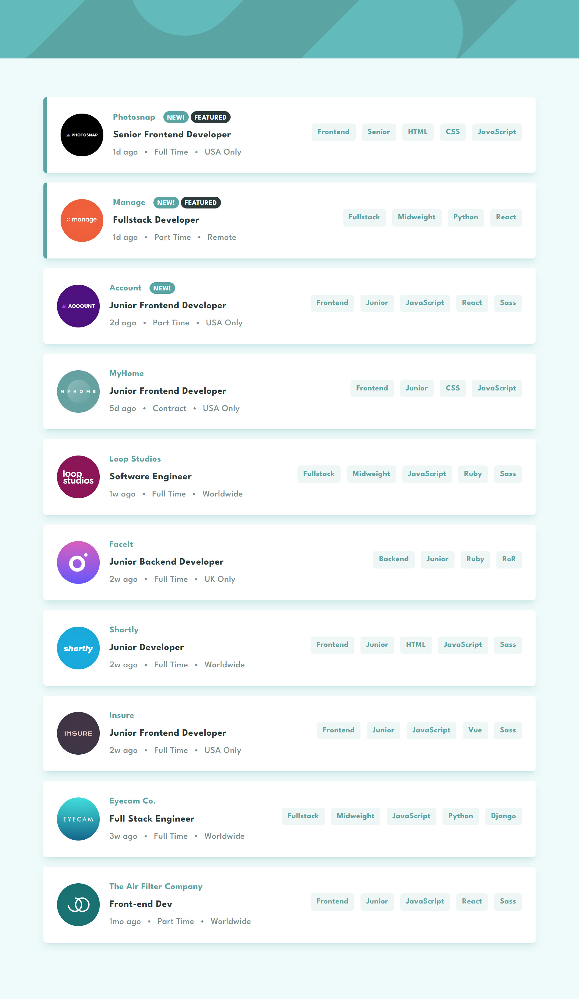

# Frontend Mentor - Job listings with filtering solution

This is a solution to the [Job listings with filtering challenge on Frontend Mentor](https://www.frontendmentor.io/challenges/job-listings-with-filtering-ivstIPCt). Frontend Mentor challenges help you improve your coding skills by building realistic projects. 

## Table of contents

- [Overview](#overview)
  - [The challenge](#the-challenge)
  - [Screenshot](#screenshot)
  - [Links](#links)
- [My process](#my-process)
  - [Built with](#built-with)
  - [What I learned](#what-i-learned)
  - [Continued development](#continued-development)
  - [Useful resources](#useful-resources)
- [Author](#author)
- [Acknowledgments](#acknowledgments)

## Overview

### The challenge

Users should be able to:

- View the optimal layout for the site depending on their device's screen size
- See hover states for all interactive elements on the page
- Filter job listings based on the categories

### Screenshot

### Links

- Solution URL: [https://github.com/Afnanmk/static-job-listings]
- Live Site URL: [https://6477b83f165cac179d5ed03a--graceful-pithivier-a3a325.netlify.app/]

## My process

### Built with

- Semantic HTML5 markup
- CSS custom properties
- [https://tailwindcss.com/] - css framework

## Author

- Website - [Afnan Malik](https://afnanmk.github.io/portfolio-production/)
- Frontend Mentor - [@Afnanmk](https://www.frontendmentor.io/profile/Afnanmk)
- Twitter - [@afnanmk22](https://twitter.com/afnanmk22)

## Acknowledgments

- [https://github.com/volkanguneri] [https://www.frontendmentor.io/profile/Victor353535] - His solution has helped me alot in this project. I got some ideas from his solution which helped me to complete the challenge successfully. I really appreciate his work.

